# Dotfiles

This repository contains my personal dotfiles, scripts, and configuration
setups that define my Linux development environment, productivity tools, and
desktop workflows. The goal is to have a **fully reproducible, aesthetic, and
highly efficient setup** for coding, note-taking, and daily system usage.

---

## Niri Desktop

A clean and minimal **Niri Wayland desktop environment** designed for focus and speed.
The layout emphasizes distraction-free workspaces, smooth tiling, and a visually
balanced setup that blends productivity with aesthetic simplicity.

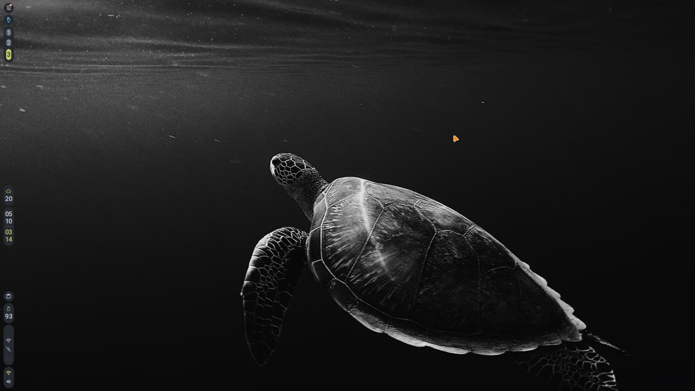

---

## Niri Workspaces Canvas

A visual overview of how **multiple workspaces are organized in Niri**.
Each workspace acts as an isolated environment for different tasks such as
coding, documentation, browsing, or system monitoring, allowing seamless context switching.

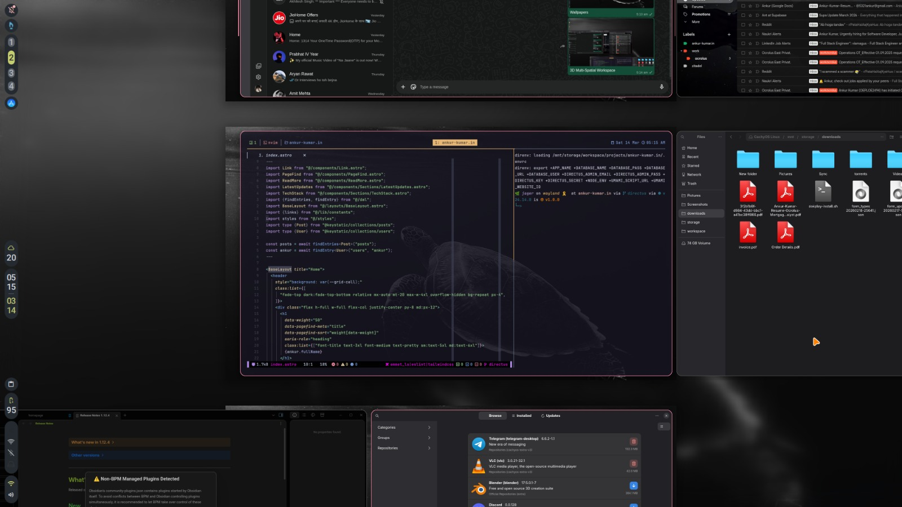

---

## Niri Workspace Layout

Example of a **single active workspace** in Niri showing tiled windows arranged
efficiently. The layout focuses on maximizing screen usage while keeping
navigation intuitive and predictable.

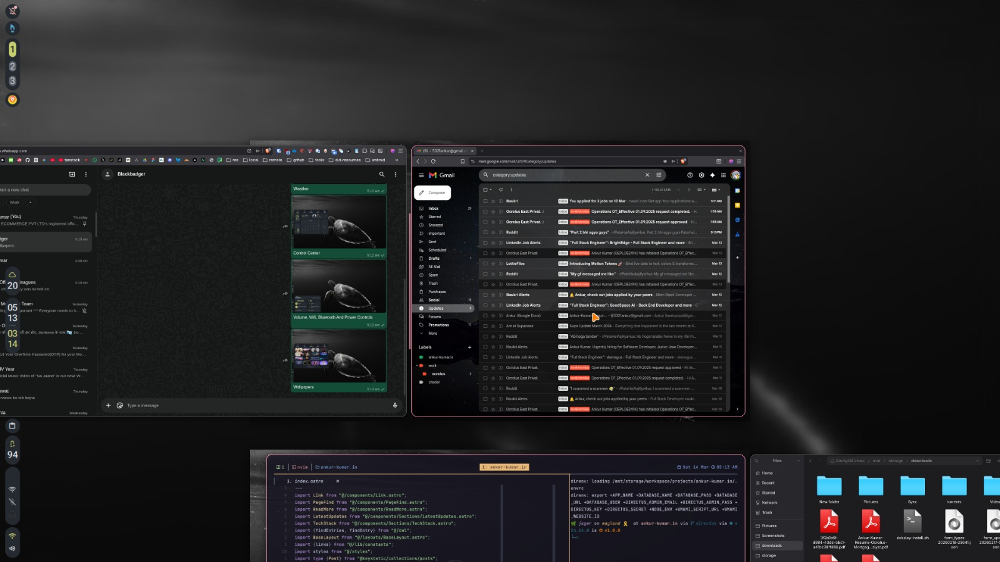

---

## Niri Keybindings Helper Script

A custom script that displays **available Niri keybindings**.
It acts as a quick reference panel to learn or recall shortcuts while working.

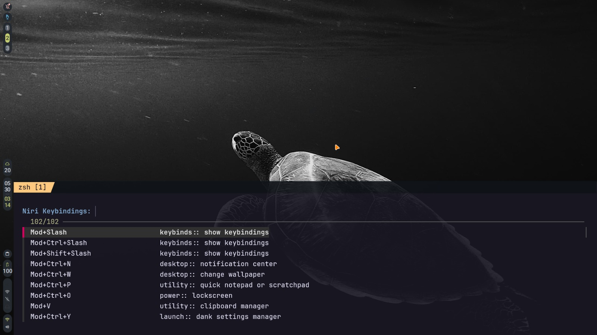

---

## Multi-Browser History Search

A utility script that aggregates and searches **history from multiple browsers**.
It provides a unified interface to quickly find previously visited pages
regardless of which browser was used.

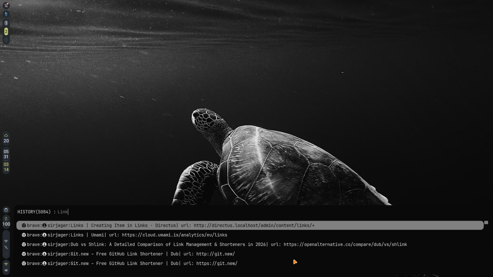

---

## Dank Material Shell Overview

A customized **Dank Material Shell** interface providing quick access to system
information, shortcuts, and desktop utilities. The shell acts as a central
control layer that enhances usability without interrupting the workflow.

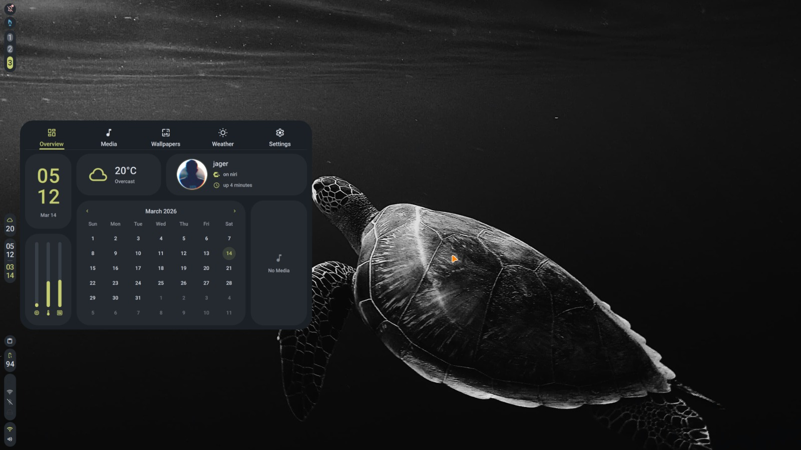

---

## Dank Material Shell Weather

Weather information integrated directly into the shell interface.
This panel displays real-time conditions and forecasts, allowing quick
environmental awareness without opening external applications.

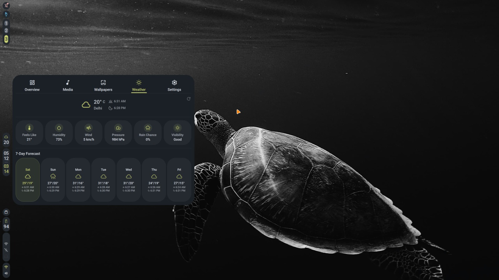

---

## Dank Material Shell System Controls

A compact panel containing **system controls and quick toggles**.
From here, common settings such as volume, brightness, networking, and system
states can be managed instantly.

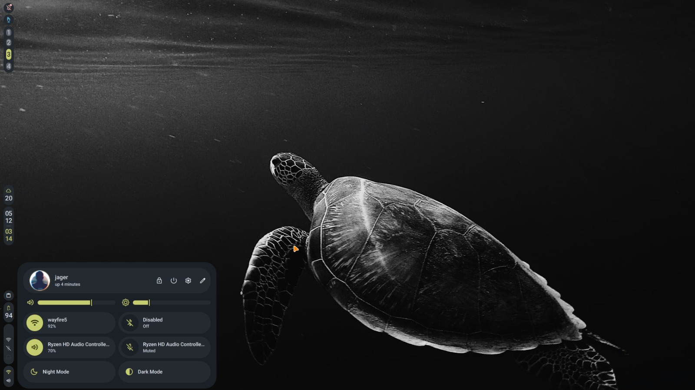

---

## Dank Material Shell Wallpaper Manager

A wallpaper management interface built into the shell.
It allows fast switching between backgrounds and maintaining a visually
consistent desktop aesthetic.

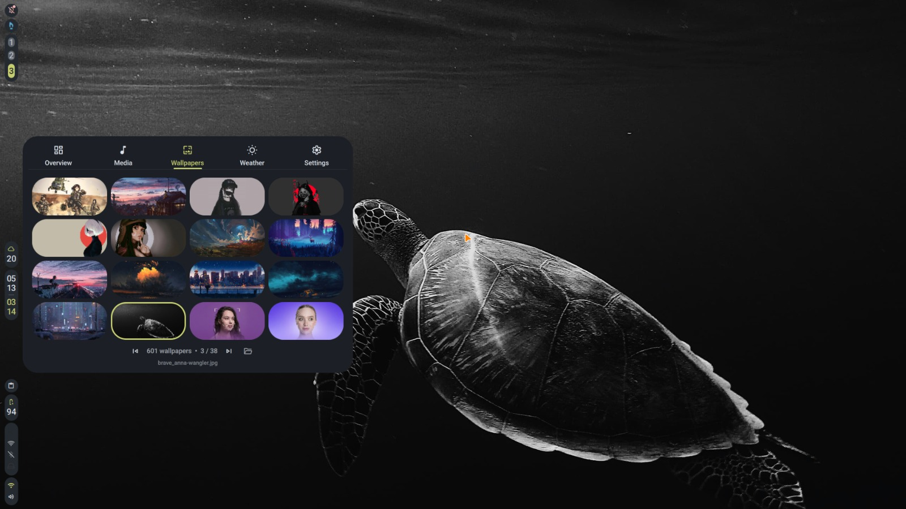

---

## Obsidian for Notes

**Obsidian** serves as the primary knowledge management system.
Notes are written in Markdown and organized into a personal knowledge base for
documentation, ideas, research notes, and technical references.

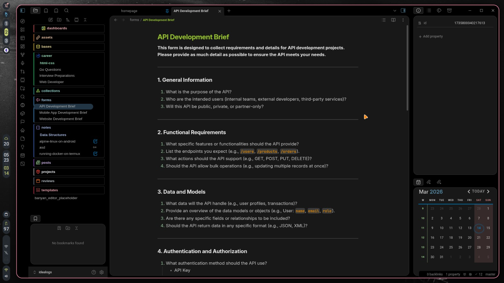

---

## Obsidian Mindmap Visualization

A graphical representation of notes using **mind-map style visualization**.
This view helps explore relationships between concepts and navigate complex
knowledge structures.

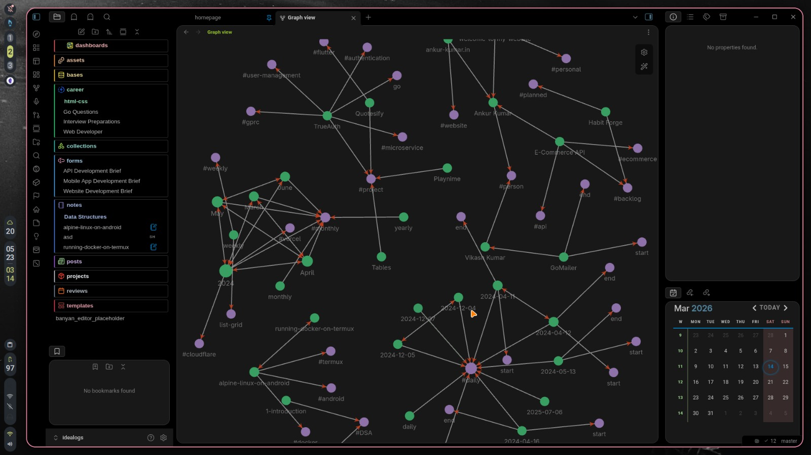

---

## OnlyOffice

**OnlyOffice** provides document editing capabilities including word processing,
spreadsheets, and presentations. It integrates well into the workflow when
working with standard office file formats.

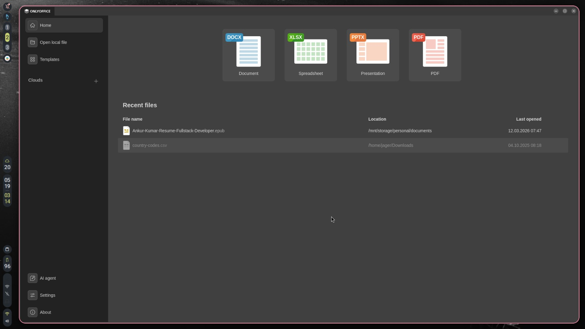

---

## Neovim Editor

A heavily customized **Neovim setup** optimized for development.
It includes advanced keybindings, plugin integrations, and an efficient editing
environment tailored for coding workflows.

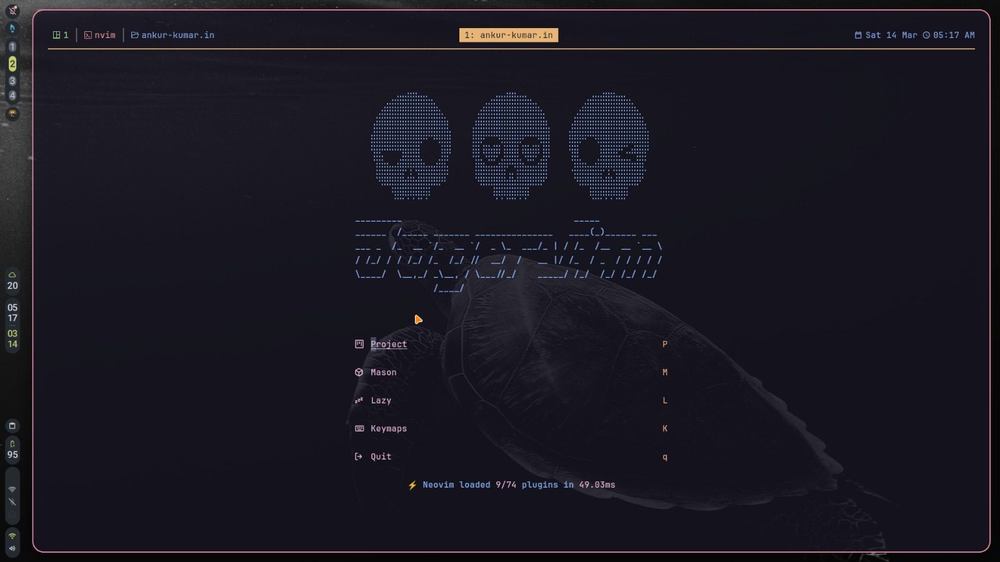

---

## Neovim Editing View

Another view of the Neovim environment showcasing additional configuration,
layout preferences, and plugin integrations that enhance editing productivity.

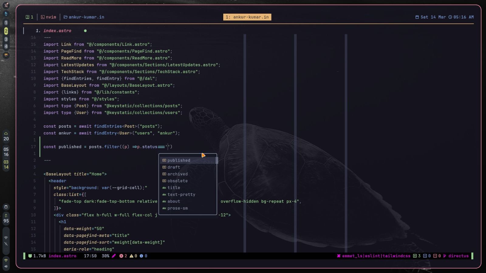

---

## Markdown Presentations

Slides generated directly from **Markdown using a CLI presentation tool**.
This allows creating and presenting technical slides without leaving the terminal
or maintaining separate presentation files.

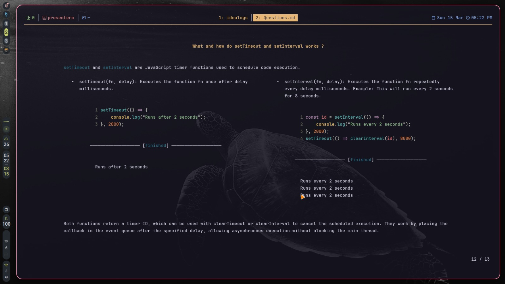

---

## Docker Management

A terminal interface for managing Docker containers using **LazyDocker**.
It simplifies container monitoring, logs, and lifecycle management directly
from the terminal.

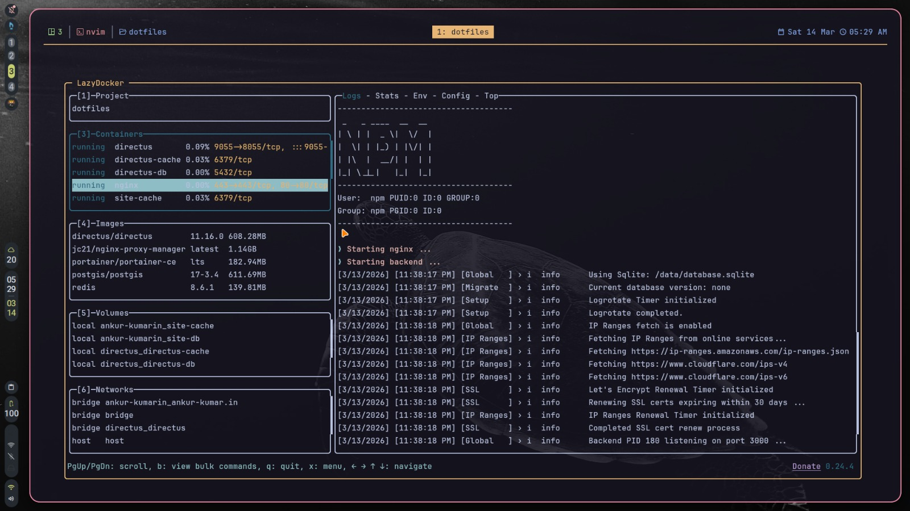

---

## Requirements

Ensure that you have the following tools installed:

### Git

```bash
pacman -S git
```

### Stow

```bash
pacman -S stow
```

---

## Installation

First, check out the dotfiles repo in your $HOME directory using git

```bash
git clone git@github.com/sirjager/dotfiles.git
cd dotfiles
```

then use GNU stow to create symlinks

```bash
stow .
```
